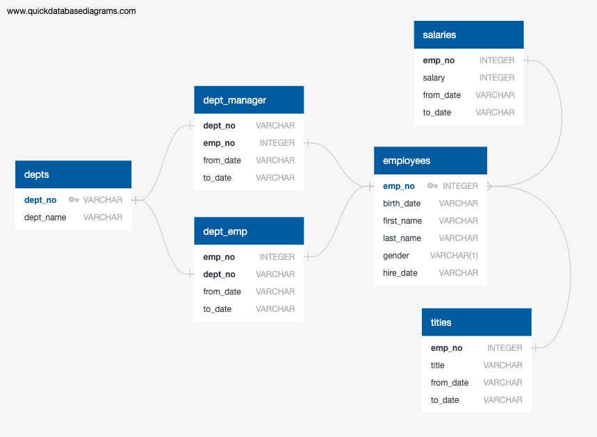
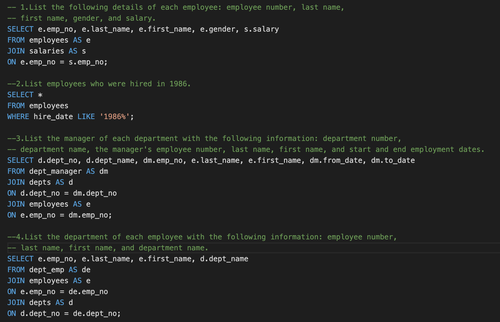
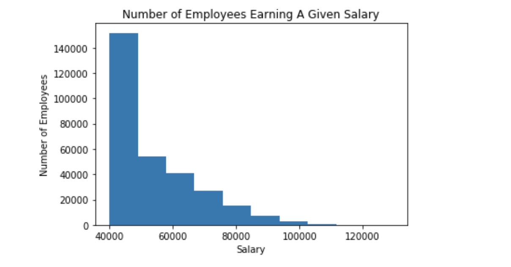

# sql-challenge

## Project Overview

Given 6 CSV files with employee information at a certain company, the goal of this project was to design tables in Postgres to hold the information provided by the CSVs, import the CSVs into a SQL database, and then query to answer specific questions about the data. 

In order to accompish this goal, the following steps were performed:
- Data Modeling
- Data Engineering
- Data Analysis
- Data Visualization

## Data

The original data is in the form of 6 CSV files that can be found in the [Data folder](https://github.com/jobrien1726/sql-challenge/tree/master/Data) above.

## Data Modeling

The first step is inspecting the files and sketching an ERD (Entity Relationship Diagram) of the tables. The visual representation of the database relations ERD is created using a [free online source](http://www.quickdatabasediagrams.com).

## Data Engineering

Using the ERD as a guide, table schema is created in Postgres, including data types, primary keys, foreign keys, as well as any other constraints. The table schema can be found [here](https://github.com/jobrien1726/sql-challenge/blob/master/EmployeeSQL/tables_schema.sql). 

## Data Analysis

Once the CSV files are loaded into the tables in Postgres and the database is complete, the analysis is done by querying the following:

1. List the following details of each employee: employee number, last name, first name, gender, and salary.
2. List employees who were hired in 1986.
3. List the manager of each department with the following information: department number, department name, the manager's employee number, last name, first name, and start and end employment dates.
4. List the department of each employee with the following information: employee number, last name, first name, and department name.
5. List all employees whose first name is "Hercules" and last names begin with "B."
6. List all employees in the Sales department, including their employee number, last name, first name, and department name.
7. List all employees in the Sales and Development departments, including their employee number, last name, first name, and department name.
8. In descending order, list the frequency count of employee last names, i.e., how many employees share each last name.

For example, here are the queries to answer the first four questions from above:

The rest of the queries can be found [here](EmployeeSQL/analysis_queries.sql).

## Data Visualization

Using SQLAlchemy, the SQL database is then imported into Pandas by creating an engine and establishing a connection to the database in Postgres. If we take a look at the total number of employees that are earning each salary, we see that the plot is heavily skewed toward a salary of $40,000, meaning a large majority of the employees are earning $40,000.

